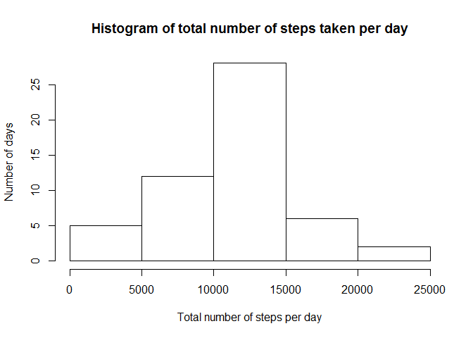
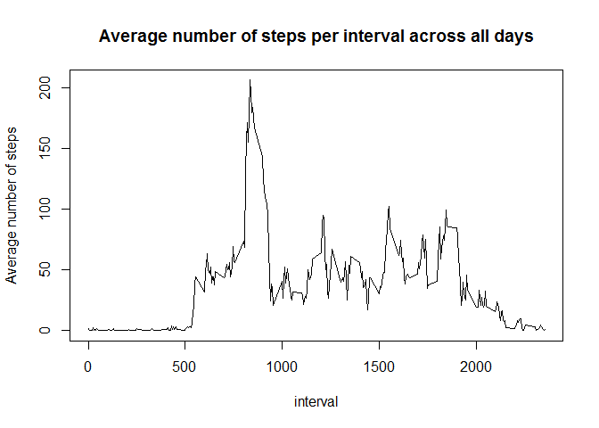
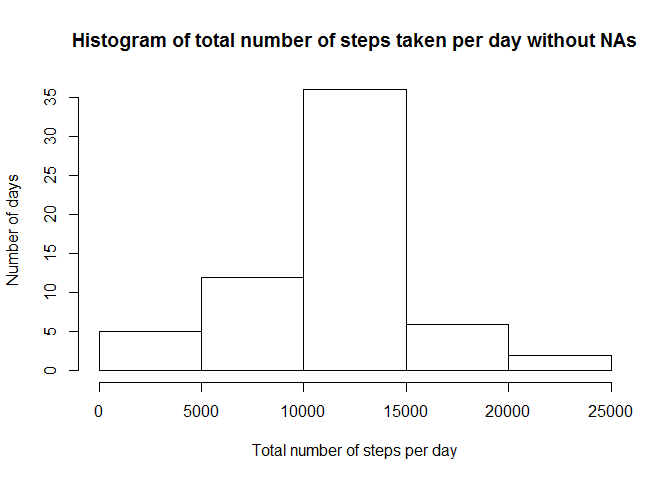
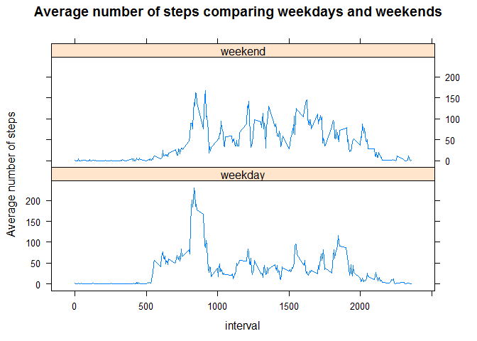

# Reproducible Research: Peer Assessment 1


## Loading and preprocessing the data

First of all we have to load the data. I will do it directly from the zip file by
using the a `unzip` function. The date column should be read as `Date` data type.

Then we remove all values with no steps values.


```r
data <- read.csv(file = unzip("activity.zip", files = "activity.csv"),
                 colClasses=c(date = "Date"))
noNA <- data[!is.na(data$steps), ]
```
 
## What is mean total number of steps taken per day?

We use the `dplyr` package to group by day and calculate the sum of steps for  
each day. From that `sumPerDay` we can calculate the mean steps per day.


```r
library(dplyr)
sumPerDay <- noNA %>% group_by(date) %>% summarise(sum(steps))
```

Histogram of total steps per day shows that on most days between 10000 and 15000 
steps were taken.

```r
hist(sumPerDay$`sum(steps)`, ylab = "Number of days", xlab = "Total number of steps per day", 
     main = "Histogram of total number of steps taken per day")
```

<!-- -->

```r
meanStepsPerDay   <- as.character(mean(sumPerDay$`sum(steps)`))
medianStepsPerDay <- median(sumPerDay$`sum(steps)`)
```

The mean value of steps per day is 10766.1886792453.  
The media value of steps per day is 10765.

## What is the average daily activity pattern?
im
Grouped by interval we can see that between interfav 500 an 2000 the majority of
steps are taken.

```r
meanPerInterval <- noNA %>% group_by(interval) %>% summarise(mean(steps))
plot(meanPerInterval$interval, meanPerInterval$`mean(steps)`, type = "l", 
     xlab = "interval", ylab = "Average number of steps", 
     main = "Average number of steps per interval across all days")
```

<!-- -->

The interval with the most steps averaged across all days is:

```r
maxSteps <- meanPerInterval[meanPerInterval$`mean(steps)` == max(meanPerInterval$`mean(steps)`), ]
i <- maxSteps$interval
n <- maxSteps$`mean(steps)`
```
The interval with the most steps is 835 that has 206.1698113 steps on average.

## Imputing missing values

The total number of entries with missing values is:

```r
na <- data[is.na(data$steps), ]
nrow(na)
```

```
## [1] 2304
```

Fill in missing values with the average value for that interval over all days.

```r
for(i in 1:nrow(na)) { 
    na[i, ]$steps <- as.integer(meanPerInterval[meanPerInterval$interval == na[i, ]$interval, ]$`mean(steps)`)
}
allFilled <- merge(noNA, na, by =c("date", "interval", "steps"), all = TRUE)
sumPerDay <- allFilled %>% group_by(date) %>% summarise(sum(steps))
```

Histogram of total steps per day without NAs filled with default values.

```r
hist(sumPerDay$`sum(steps)`, ylab = "Number of days", 
     xlab = "Total number of steps per day", 
     main = "Histogram of total number of steps taken per day without NAs")
```

<!-- -->

```r
meanStepsPerDay   <- as.character(mean(sumPerDay$`sum(steps)`))
medianStepsPerDay <- median(sumPerDay$`sum(steps)`)
```

The mean value of steps per day is 10749.7704918033.  
The media value of steps per day is 10641.

After filling in values for all `NA` values the results are a little bit different. 
The main differnece is that the number of days where between 10000 and 15000 steps 
are counted increses and the mean number moves further away from the median.

## Are there differences in activity patterns between weekdays and weekends?

We have to add a new column that indicates wether the day is a weekday or a weekend 
in order to be able to group weekdays and weekends together. For plotting we use 
the package `lattice`.

```r
library(lattice)
allFilled <- cbind(allFilled, weekend=factor(weekdays(allFilled$date, abbreviate = T) %in% c("Sa", "So"), labels = c("weekday", "weekend")))
meanPerInterval  <- allFilled %>% group_by(weekend, interval) %>% summarise(mean(steps))

xyplot(`mean(steps)`~interval|weekend, meanPerInterval, type='l', layout = c(1,2),
       ylab="Average number of steps",
       main="Average number of steps comparing weekdays and weekends")
```

<!-- -->
